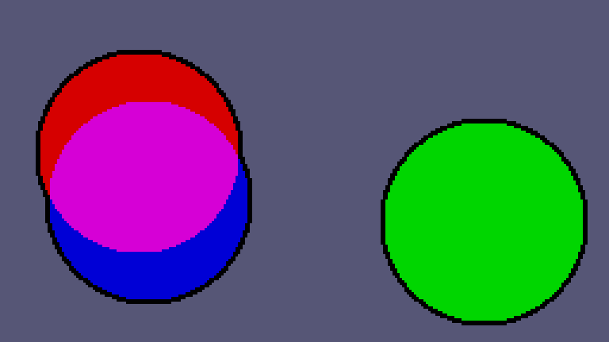

# fake-bitplanes



```
width=240
height=136

ballCount=3
ballSize=44

bgColour=0
circleColour=0xd6

xLimit=(width/2)-ballSize
yLimit=(height/2)-ballSize

t=0

function setColour(r,g,b,idx)
	PALETTE_MAP = 0x3FC0
	red=PALETTE_MAP+idx*3
	green=red+1
	blue=red+2
	poke(red,r)
	poke(green,g)
	poke(blue,b)
end

function circle(x,y,radius,colour)
	for i=x-radius,x+radius do
		for j=y-radius,y+radius do
				dx=i-x
				dy=j-y
			if (dx*dx+dy*dy<radius*radius) then
				pix(i,j,colour)
			end
		end
	end 
end

function circleAdd(x,y,radius,colour)
	for i=x-radius,x+1+radius do
		for j=y-radius,y+1+radius do
				dx=i-x
				dy=j-y
			if (dx*dx+dy*dy<radius*radius) then
				existing=pix(i,j)
				pix(i,j,existing+colour)
			end
		end
	end 
end

setColour(0x56,0x56,0x76,0)

setColour(circleColour,0x00,0x00,1)
setColour(0x00,circleColour,0x00,2)
setColour(circleColour,circleColour,0x00,3)
setColour(0x00,0x00,circleColour,4)
setColour(circleColour,0x00,circleColour,5)
setColour(0x00,circleColour,circleColour,6)
setColour(circleColour,circleColour,circleColour,7)


setColour(0x00,0x00,0x00,8)

function TIC()

cls(bgColour)

for outline=0,2 do
for b=1,ballCount do
 alpha=b*2.56*math.pi/ballCount

 speed=b*1412+t*60/36
 x=math.sin(alpha+3.12*speed)*xLimit
 y=math.sin(alpha+2.54*speed)*yLimit

	colour=math.pow(2,b-1)
	
	if outline == 0 then
 	circle(width/2+x,height/2+y,ballSize,8)
 end
 if outline == 1 then
 	circle(width/2+x,height/2+y,ballSize-2,bgColour)
 end
 if outline == 2 then
 	circleAdd(width/2+x,height/2+y,ballSize-2,colour)
 end   		        
end
end

t=t+.005

end
```