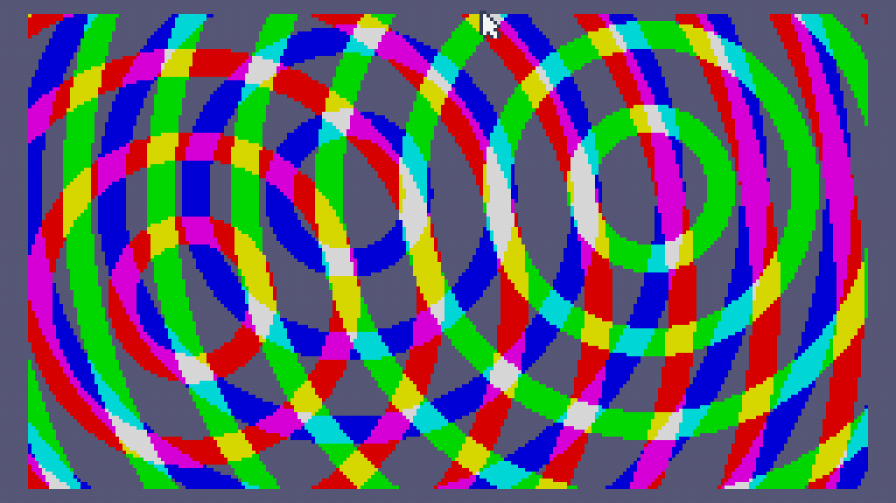

# Fake Bitplane Rings
Emulate bitplanes with some overlapping rings



```
width=240
height=136

ballCount=3
ballSize=44

bgColour=0
circleColour=0xd6

xLimit=(width/2)-ballSize
yLimit=(height/2)-ballSize

t=0

function setColour(r,g,b,idx)
	red=0x3FC0+idx*3
	green=red+1
	blue=red+2
	poke(red,r)
	poke(green,g)
	poke(blue,b)
end

function circleAdd(x,y,colour)
	stripe=4

	for i=0,width do
		for j=0,height do
			dx=i-x
			dy=j-y
	
			dist=math.sqrt(dx*dx+dy*dy)
			count=dist//stripe
			even=count%6
			
			if (even>3) then
				existing=pix(i,j)
				pix(i,j,existing+colour)
			end
		end
	end
end

setColour(0x56,0x56,0x76,0)

setColour(circleColour,0x00,0x00,1)
setColour(0x00,circleColour,0x00,2)
setColour(circleColour,circleColour,0x00,3)
setColour(0x00,0x00,circleColour,4)
setColour(circleColour,0x00,circleColour,5)
setColour(0x00,circleColour,circleColour,6)
setColour(circleColour,circleColour,circleColour,7)


setColour(0x00,0x00,0x00,8)

function TIC()
	cls(bgColour)

	for b=1,ballCount do
 	alpha=b*2.56*math.pi/ballCount

 	speed=b*1412+t*60/36
 	x=math.sin(alpha+3.12*speed)*xLimit
 	y=math.sin(alpha+2.54*speed)*yLimit

		colour=math.pow(2,b-1)

 	circleAdd(width/2+x,height/2+y,colour)  
	end

	t=t+.005
end
```